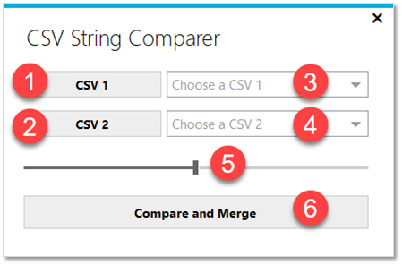

# CSV String Comparer

The "CSV String Comparer" compares and merges two CSV files based on the data (strings) of a specific selected column. 

The comparison of the two CSV files is based on the [Q-gram](https://github.com/feature23/StringSimilarity.NET#shingle-n-gram-based-algorithms) distance (q=1). The rows with the best distance in each file will be merged except that the distance is smaller than the maximum distance which is choosen. The software is developed in Visual Basic .NET.

## How to use it

1. Select the first CSV file
2. Select the second CSV file which should be merged with the first file
3. Select the column in the first CSV file which should be compared
4. Select the column in the second CSV file which should be compared
5. Set the maximum distance (default value is five)
6. Click the button "Compare and Merge" and then choose a destination and  a name for the file
7. Wait and be happy

## Thanks

The software uses the [StringSimilarity.NET](https://github.com/feature23/StringSimilarity.NET) library from [feature23](https://github.com/feature23) and the [MetroFramework](https://github.com/thielj/MetroFramework) from [thielj](https://github.com/thielj).

## License

This code is licensed under the MIT license.